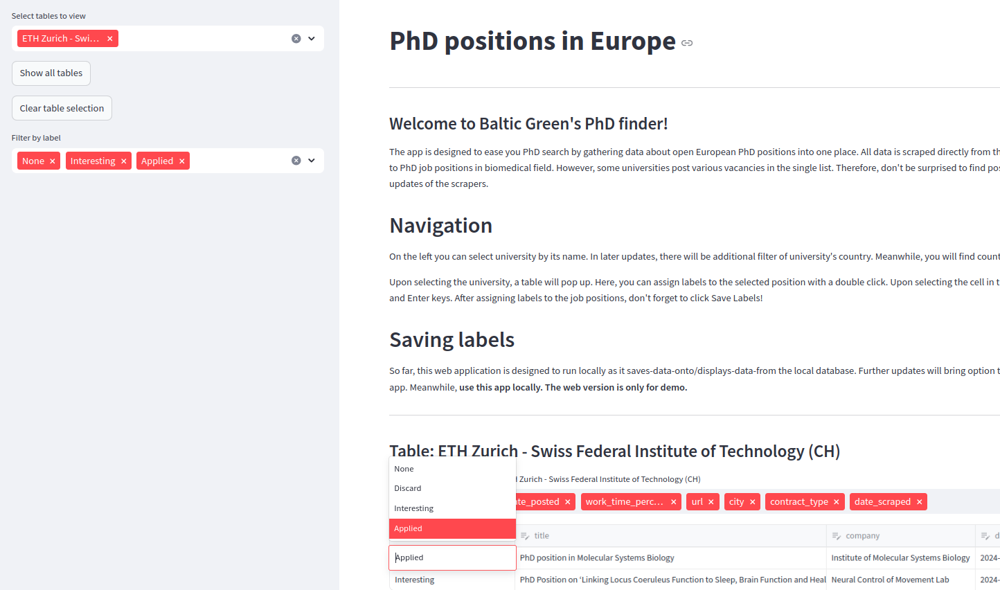

## In short... 
The app scrapes primary sources of PhD vacancies (university pages) and views them in the
single app interface. Here you can label the vacancies to follow which of them you already looked through.
The data is updated once a week.

## The data
So far, the scrapers take only vacancies of PhDs in biomedical science. However, some 
universities post everything in one list. So, some scrapers take everything and you 
may find vacancies for Post-docs or Managers in fields like gender studies or theology.
Maybe it's a sign from the above for a career change? Who knows.  ¯\_(ツ)_/¯

## Why the struggle ?

So I am looking for PhD in Norway and Switzerland and I have to constantly monitor multiple university pages for open positions which is painful.
So, being a programmer I figured I could automate this monitoring by writing a few scrapers 
and displaying gathered data in a single interface of a streamlit app. Now with few clicks I have the newest data in one place. 
Moreover - I can mark which positions to ignore, and which are interesting. 

The app is engineered with intend to upscale it. Over the time I will add scrapers for more universities. 

# Usage
You may go to the deployed app: https://phd-positions.streamlit.app/

OR

Run these commands locally be executing these commands in the console:
- Install the requirements with `pip install -r requirements.txt`
- Run `./scraping/execute_scrapers.py` to gather the data.
- Run `./db/process_db_tables.py` to process the data (parse dates, sort, join, etc.).
- Run `streamlit run ./steamlit.py` to execute the app locally in your browser

# To do
## Scraping
- Improve parallel processing of scraper execution - sometimes scrapers fail due to it.

## Processing
- Unify columns of tables. Those columns that don't match - display as other info in pop ups or other containers.
- ETH Zurich - Swiss Federal Institute of Technology (CH) - add 'jobs.' to the beginning of job url. 
- Filter data of Swiss Universities - keep only those that offer 90% or more occupancy.
- Reorder columns - put essentials first: "title", "url", "deadline" ... other columns
- Move scraping and processing to Github actions
## Application
- Add filtering for countries
- Update scrapers to filter out non-biomedical, non-phd vacancies
- Create 2nd scraper to scrape deeper data from individual job offers
- Create on button 'Save Labels' for all tables and place it to the side panel near the filters.
- Add option to upload/download of own labels for use in web app
- Add option to download labeled tables as one or multiple datasets
- Add option to update deadline column (or the whole record)
- Add column for specific annotations

# Further institutions to add
Swiss bioinformatics institute: https://apply.refline.ch/499599/search.html
University Hospitals
Netherland Universities
Swedish Universities